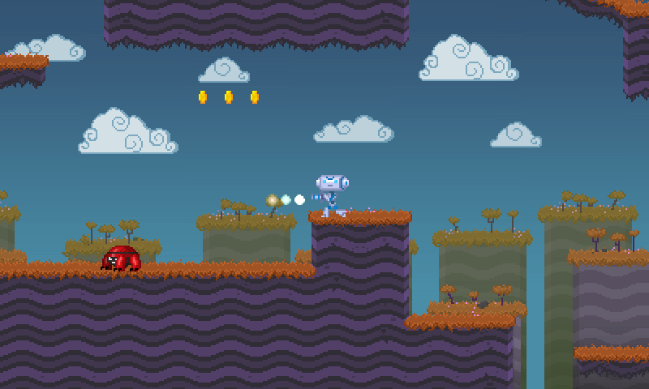
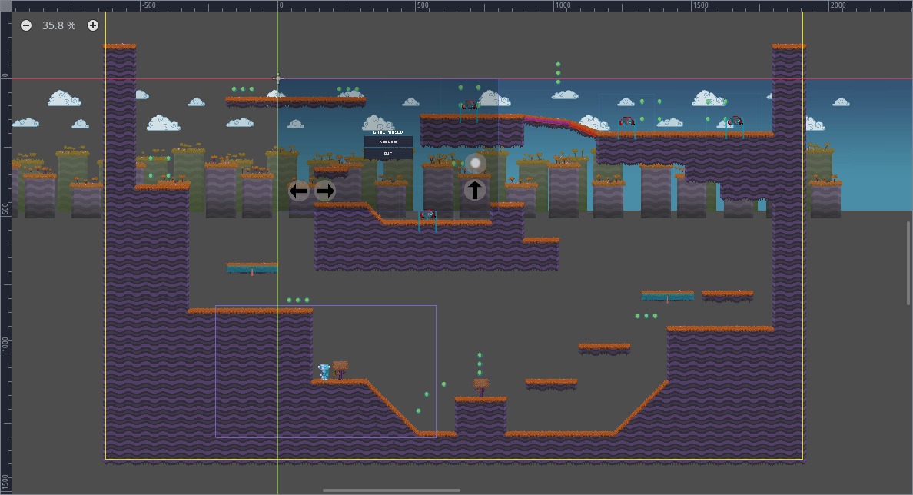

# 2D Platformer
By nisapinklava

Language: GDScript

## Features

- Side-scrolling player controller using [`KinematicBody2D`](https://docs.godotengine.org/en/latest/classes/class_kinematicbody2d.html).
    - Can walk on and snap to slopes.
    - Can shoot, including while jumping.
- Enemies that crawl on the floor and change direction when they encounter an obstacle.
- Camera that stays within the level’s bounds.
- Supports keyboard and gamepad controls.
- Platforms that can move in any direction.
- Gun that shoots bullets with rigid body (natural) physics.
- Collectible coins.
- Pause and pause menu.
- Pixel art visuals.
- Sound effects and music.

## Screenshots

